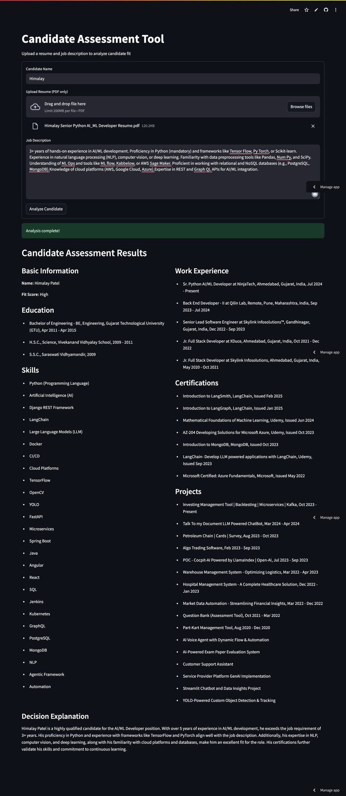

# Candidate Assessment Tool

A Streamlit application that analyzes candidate resumes against job descriptions to determine fit scores and provide comprehensive assessments.

## Features

- Upload and analyze PDF resumes
- Input job descriptions for comparison
- Automatic online search for additional candidate information
- Extract content from URLs found in resumes
- Comprehensive assessment with fit scoring
- Detailed breakdown of candidate skills, experience, education, and more

## How It Works

1. Upload a candidate's resume (PDF format)
2. Enter the job description
3. Provide the candidate's name
4. Click "Analyze Candidate" to process
5. View detailed assessment results including:
   - Basic candidate information
   - Education history
   - Skills assessment
   - Work experience
   - Certifications and projects
   - Publications (if available)
   - Overall fit score and decision explanation

## Demo

## Technologies Used

- Streamlit for the web interface
- LangGraph for workflow orchestration
- LangChain for LLM integration
- OpenAI GPT-4o for analysis
- Google Custom Search API for online candidate research
- PyPDF for PDF processing

## Setup

1. Clone the repository
2. Install dependencies: `pip install -r requirements.txt`
3. Set up environment variables:
   - `OPENAI_API_KEY`
   - `GOOGLE_API_SECRET`
   - `GOOGLE_CX_SECRET`
4. Run the application: `streamlit run main.py`

## License

MIT
